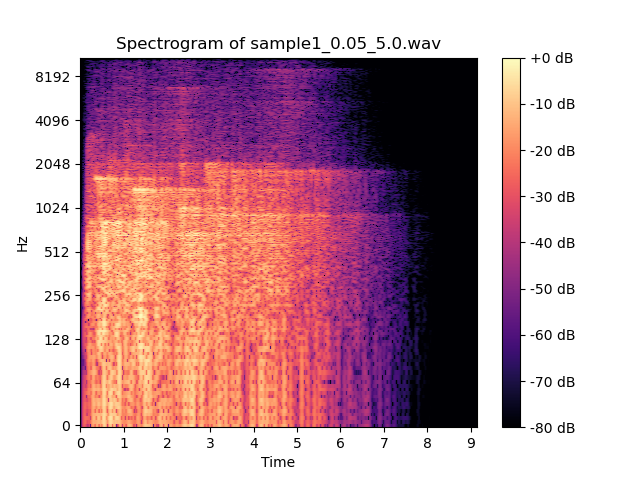

# Vibrato Implementation Comparison

Here are quick comparisons of the vibrato implementations between the one given in book (translated to Python for quicker listening test) and the Rust implementation using plotted spectrograms.

## Example 1

## Example 2

## Observations

All the audios were process with the same modulation frequency (`5Hz`) and variable modulation width (`0.01`, `0.05`, `0.1`). The delay time is same as the modulation width.

We can see the rust implementation using LFO wavetable differs from the one given in the book most when the modulation width is low. This can be seen in the plot where the audio processed with wavetable using 0.01 (`10ms`) modulation width delay. The filter attenuated power in the higher frequency range. However, as the modulation width increases, the difference between the two implementations decreases. This can be seen in the plot where the audio processed with wavetable using 0.1 (`100ms`) modulation width delay.

A poosible explanation can be the delay buffer being not long enough to capture all the frequency component presented in the audio given fixed modulation frequency. Delay is calculated by `DELAY+WIDTH*MOD`, with fixed modulation rate (determined by the modulation frequency and sample rate), the the delay buffer will contain most of the sample with same frequency. As the modulation length increases, the delay buffer will contain more samples with different frequency, thus the difference between the two implementation decreases.
